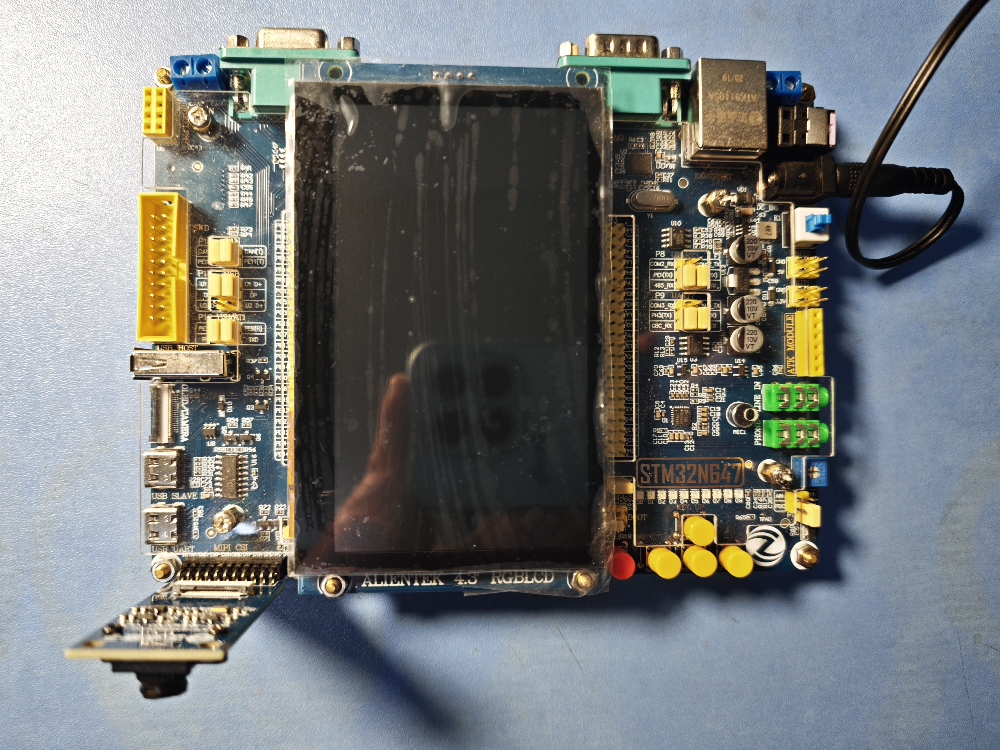
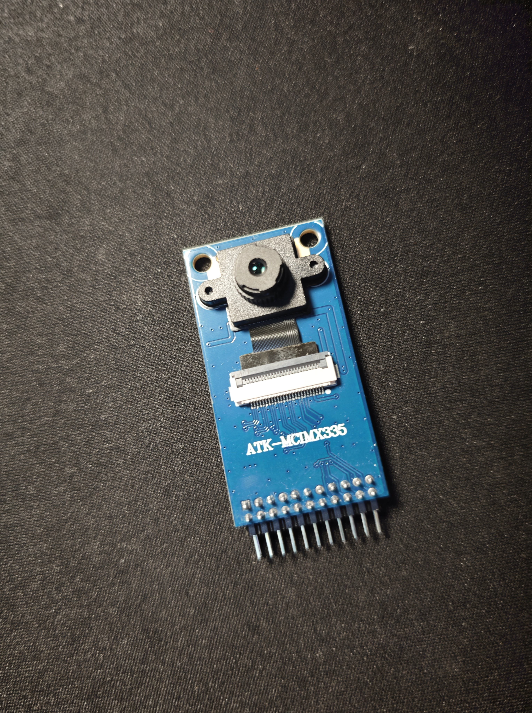
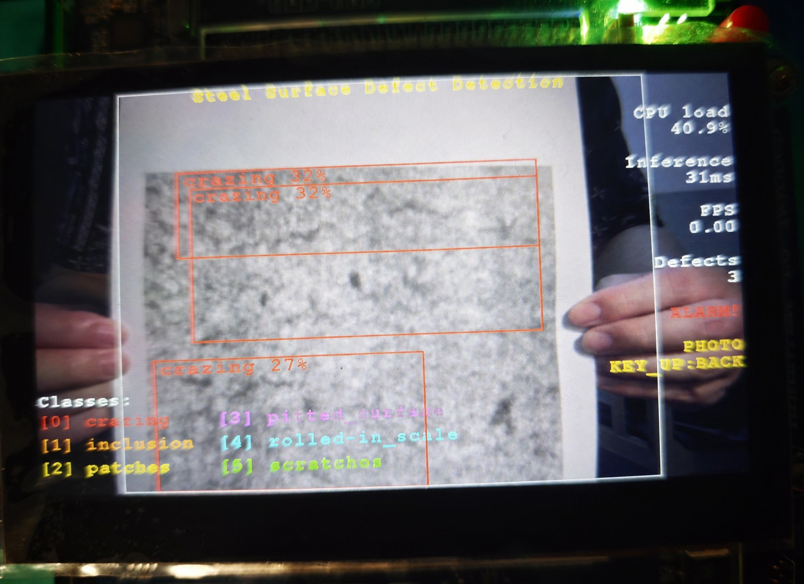
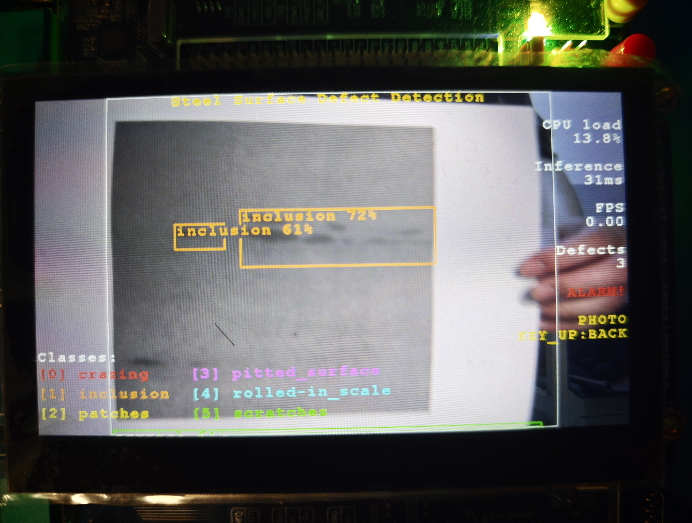
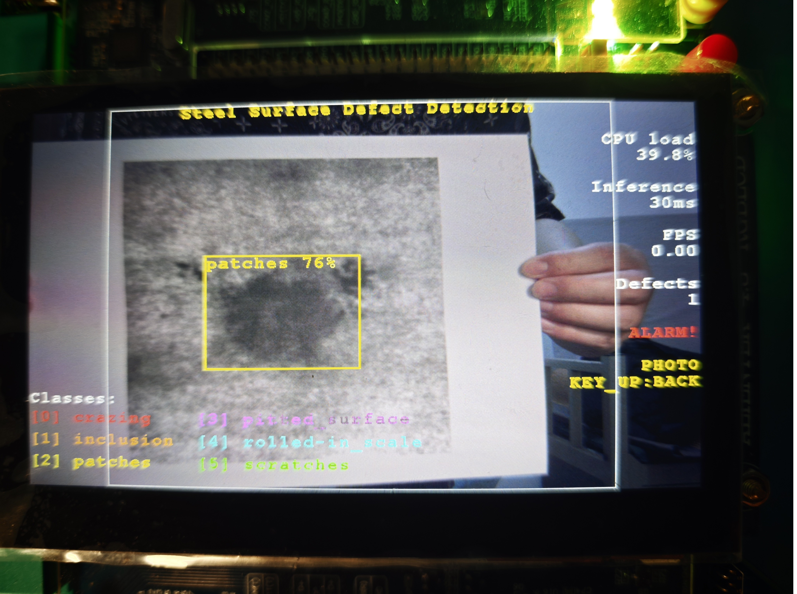
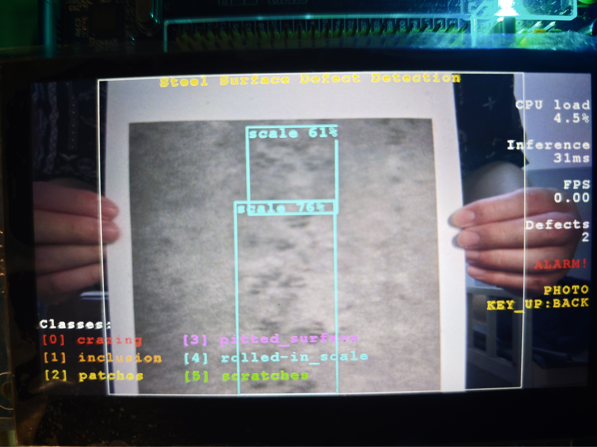
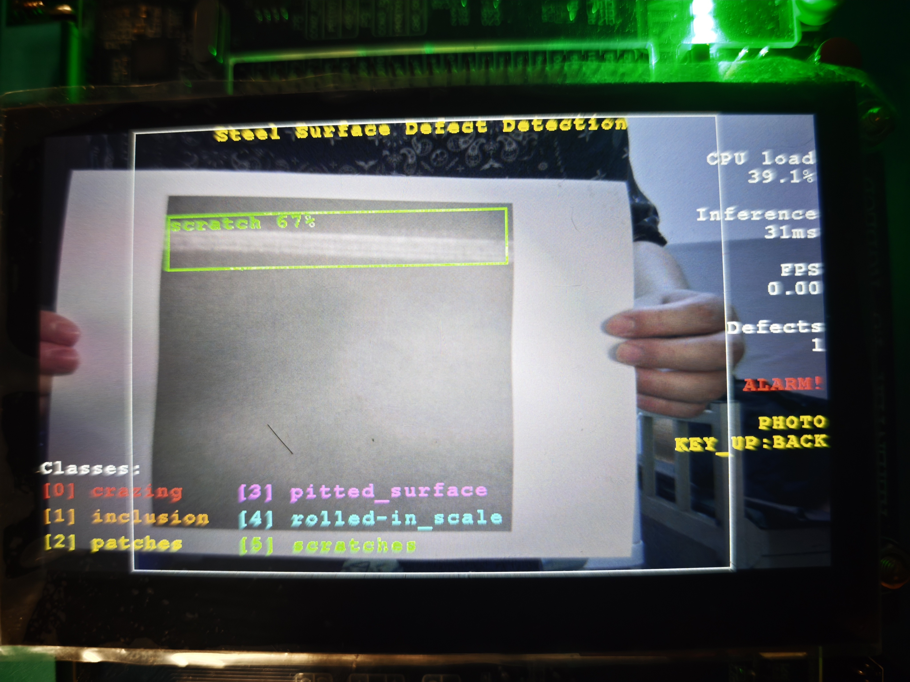

# 基于STM32的带钢表面缺陷检测系统与深度学习模型优化

本项目在 STM32N647 开发板上实现带钢表面缺陷检测：IMX335 摄像头采集图像，DCMIPP 分别输出 LCD 显示流与 NPU 推理流，YOLOv8n INT8 模型在 STM32N647 Neural-ART NPU 上运行，最终在 800×480 RGBLCD 上叠加缺陷类别、检测框、置信度和运行状态，并通过板载 LED 输出缺陷报警。

> 说明：本项目用于2026年全国大学生嵌入式芯片与系统设计竞赛

当前部署模型面向 NEU-DET 六类缺陷：`crazing` 、`inclusion` 、`patches` 、`pitted_surface` 、`rolled-in_scale` 、`scratches` 。模型输入为 `256×256×3 RGB888`，部署格式为 INT8 TFLite 经 ST Edge AI / X-CUBE-AI 生成的 NPU 代码与权重数据。

## 项目特性

- 基于 STM32N647 Cortex-M55 + Neural-ART NPU 的嵌入式目标检测部署。
- 使用 IMX335 摄像头和 DCMIPP 双管道：一路用于 RGBLCD 实时预览，一路用于 256×256 NPU 输入。
- YOLOv8n INT8 检测模型，输出经 STM32_VISION_MODELS_PP YOLOv8 后处理。
- 支持实时识别与按键拍照识别两种模式。
- LCD 显示检测框、类别、置信度、FPS、CPU load、PASS/ALARM 状态。
- 按类别设置显示阈值，弱类缺陷可保留更高召回。

## 原型系统与检测样例

系统原型由 STM32N647 开发板、IMX335 摄像头和 RGBLCD 显示模块构成。摄像头画面经 DCMIPP 送入显示链路和 NPU 推理链路，板端直接完成缺陷检测、结果叠加和报警输出。

<table>
  <tr>
    <td align="center" width="50%">
      
      <br>STM32N647 开发板
    </td>
    <td align="center" width="50%">
      
      <br>IMX335 摄像头
    </td>
  </tr>
</table>

下列样例展示六类带钢表面缺陷的板端检测效果。检测框、类别和置信度由嵌入式端实时生成，显示结果用于验证模型部署和后处理链路的有效性。

<table>
  <tr>
    <td align="center" width="50%">
      
      <br>crazing
    </td>
    <td align="center" width="50%">
      
      <br>inclusion
    </td>
  </tr>
  <tr>
    <td align="center" width="50%">
      
      <br>patches
    </td>
    <td align="center" width="50%">
      
      <br>pitted_surface
    </td>
  </tr>
  <tr>
    <td align="center" width="50%">
      
      <br>rolled-in_scale
    </td>
    <td align="center" width="50%">
      
      <br>scratches
    </td>
  </tr>
</table>

## 硬件环境

| 硬件 | 说明 |
| --- | --- |
| 开发板 | 正点原子 STM32N647 开发板或兼容 STM32N647X0HxQ 平台 |
| MCU | STM32N647，Cortex-M55 + Neural-ART NPU |
| 摄像头 | IMX335 |
| 显示屏 | 800×480 RGBLCD |
| 外部存储 | XSPI NOR Flash / HyperRAM，按 STM32N6 官方例程配置 |
| 下载调试 | ST-LINK + STM32CubeProgrammer |

## 软件环境

### 必需工具

| 工具 | 建议版本/要求 | 用途 |
| --- | --- | --- |
| STM32CubeIDE | 1.17 左右，随 IDE 安装 GNU Arm Embedded Toolchain | 导入并编译 FSBL / Appli 工程 |
| STM32CubeProgrammer | 与 STM32N6 兼容版本 | 烧录 `fsbl.hex`、`appli.hex`、`network-data.hex` |
| STM32N6 Software Package | 与当前工程匹配的官方软件包 | 提供 HAL、BSP、ThreadX、Camera、ISP、AI Runtime、Vision Models PP 等依赖 |
| ST Edge AI / X-CUBE-AI | 建议使用与工程运行库匹配的版本；当前工程按 ST Edge AI 2.0 生成过模型文件 | 将 TFLite 模型转换为 STM32N6 NPU 可运行代码和权重数据 |

### Python 环境

用于准备数据集、训练 YOLO、导出 ONNX/TFLite 和辅助分析。

建议环境：

```bash
conda create -n tflite python=3.10
conda activate tflite
pip install ultralytics torch torchvision onnx tensorflow numpy opencv-python matplotlib pyyaml
```

实际训练环境可能受 CUDA、PyTorch 与显卡驱动版本影响。若只复现板端固件，可直接使用仓库中已有的 `Model/yolov8n_steel_int8.tflite`、`Model/network.c`、`Model/network_ecblobs.h` 和 `Model/network_data.xSPI2.bin`。

## 目录结构

```text
.
├─ Appli/                          			 应用层源码
├─ FSBL/                           			一级启动相关源码
├─ Binary/                        			最终烧录 HEX 文件
│  ├─ fsbl.hex
│  ├─ appli.hex
│  └─ network-data.hex
├─ Model/                           		TFLite 模型、ST Edge AI 输出和 NPU 权重
│  ├─ yolov8n_steel_int8.tflite
│  ├─ network.c
│  ├─ network_ecblobs.h
│  └─ network_data.xSPI2.bin
├─ STM32CubeIDE/                   CubeIDE 工程
│  ├─ FSBL/
│  └─ Appli/
├─ Drivers/ Middlewares/ Utilities/
├─ Dataset/                       			数据集或数据转换文件
├─ Picture/                       			 实物与效果图
└─ Shell/                         			   自动化编译生成HEX文件脚本
```

## 关键配置

| 项目 | 当前配置 |
| --- | --- |
| 模型 | YOLOv8n steel defect detector |
| 输入尺寸 | `256×256×3` |
| 输入格式 | RGB888，UINT8 摄像头数据在推理前转换为 INT8 |
| 模型格式 | INT8 TFLite → ST Edge AI / X-CUBE-AI NPU 代码 |
| 检测类别数 | 6 |
| 输出张量 | 1344 anchors × (4 box + 6 classes) |
| 通用后处理阈值 | `AI_OBJDETECT_YOLOV8_PP_CONF_THRESHOLD = 0.25f` |
| LCD 显示阈值 | `crazing=0.25`，`rolled-in_scale=0.45`，其余类别 `0.55` |
| 报警输出 | PE10 LED1，低电平点亮 |
| 按键 | KEY0 拍照识别，KEY_UP 返回实时识别 |

核心代码位置：

```text
Appli/Core/Inc/app_config.h
Appli/Core/Inc/postprocess_conf.h
Appli/Core/Src/app.c
Model/network.c
Model/network_ecblobs.h
Model/network_data.xSPI2.bin
STM32CubeIDE/Appli/
STM32CubeIDE/FSBL/
```

## 构建与生成烧录文件

最终需要得到三类 HEX 文件：

| 文件 | 来源 | 起始地址 | 说明 |
| --- | --- | --- | --- |
| `Binary/fsbl.hex` | 官方示例 FSBL 或经签名处理后的 FSBL | `0x70000000` | 一级启动程序 |
| `Binary/appli.hex` | `AI_Steel_Detection_Appli.bin` 转换 | `0x70100400` | 主应用固件 |
| `Binary/network-data.hex` | `Model/network_data.xSPI2.bin` 转换 | `0x70200000` | NPU 模型权重和常量数据 |

### 1. 准备 STM32N6 官方软件包

当前 CubeIDE 工程依赖 STM32N6 官方 Software Package 中的 HAL、BSP、Middlewares、AI Runtime、Vision Models PP 和官方示例资源。

不建议使用中文路径、带空格路径或过长路径，否则 ST Edge AI、CubeIDE post-build、SigningTool 或 GNU 工具链可能出现路径解析问题。

### 2. 导入 CubeIDE 工程

1. 打开 STM32CubeIDE，选择固定 workspace。
2. 选择 `File > Import > General > Existing Projects into Workspace`。
3. Root directory 选择本项目目录。
4. 导入 `AI_Steel_Detection_FSBL` 和 `AI_Steel_Detection_Appli`。
5. 若出现 include path 或 linked resource 错误，优先检查项目是否位于官方 Software Package 的正确相对位置，不要先手工添加零散头文件路径。

### 3. 转换模型权重

如果没有修改模型，可跳过本节，直接使用仓库已有的：

```text
Model/yolov8n_steel_int8.tflite
Model/network.c
Model/network_ecblobs.h
Model/network_data.xSPI2.bin
```

如果需要更换模型，按以下思路手动执行：

1. 在 STM32CubeMX / STM32CubeIDE 的 X-CUBE-AI 或 ST Edge AI 图形化界面中导入 `yolov8n_steel_int8.tflite`。
2. 目标平台选择 STM32N6 / Neural-ART NPU，保持输入尺寸 `256×256×3`，模型类型为 INT8。
3. 执行 Analyze，确认输入输出张量、量化参数和内存占用无异常。
4. 执行 Generate，生成 `network.c`、`network_ecblobs.h`、`network_data.xSPI2.bin` 等文件。
5. 将生成文件同步到 `Model/` 目录。
6. 模型文件变化后必须重新编译 `AI_Steel_Detection_Appli`，否则应用侧网络描述与权重数据可能不一致。

### 4. 编译应用工程

1. 在 CubeIDE 中右键 `AI_Steel_Detection_Appli`。
2. 选择 `Build Configurations > Set Active > Release`。
3. 选择 `Project > Build Project`。
4. 构建完成后检查是否生成：

```text
STM32CubeIDE/Appli/Release/AI_Steel_Detection_Appli.bin
```

如果只生成 `.elf`，需要在 `Project Properties > C/C++ Build > Settings` 中启用 binary output，或检查工程中的 post-build 设置。

### 5. 生成 appli.hex

`appli.hex` 不是普通编译得到的文件，而是应用 BIN 文件带地址转换后的 Intel HEX。可在 CubeIDE 的 `External Tools` 图形化配置中调用 `arm-none-eabi-objcopy.exe`，而不是运行项目脚本。

配置含义如下：

```bash
arm-none-eabi-objcopy.exe \
  -I binary STM32CubeIDE/Appli/Release/AI_Steel_Detection_Appli.bin \
  --change-addresses 0x70100400 \
  -O ihex Binary/appli.hex
```

在 CubeIDE 中可将 `Location` 设置为工具链目录下的 `arm-none-eabi-objcopy.exe`，`Working Directory` 设置为项目根目录，`Arguments` 填写上述参数中除可执行文件外的部分。

### 6. 生成 network-data.hex

`network-data.hex` 来自模型权重二进制文件，同样需要地址转换：

```bash
arm-none-eabi-objcopy.exe \
  -I binary Model/network_data.xSPI2.bin \
  --change-addresses 0x70200000 \
  -O ihex Binary/network-data.hex
```

若坚持完全不调用 `objcopy`，则无法可靠生成带目标地址的 Intel HEX 文件。更合理的手动做法是在 CubeIDE 的 External Tools 页面保存该工具配置，通过 IDE 按钮触发。

### 7. 准备 fsbl.hex

如果没有修改 FSBL，建议直接使用官方示例中已验证的 `fsbl.hex`，并复制到：

```text
Binary/fsbl.hex
```

如果修改过 FSBL，必须使用 ST 官方签名工具或工程后处理步骤生成签名后的 FSBL，再转换为起始地址 `0x70000000` 的 HEX。不要把未签名 FSBL ELF 直接作为最终烧录文件。

## Shell 脚本配置与用法

仓库的 `Shell/` 目录提供了可选的自动化脚本，用于完成“ST Edge AI 生成模型文件 → CubeIDE headless 编译 → objcopy 打包 HEX”的流程。如因软件工具无法编译复现，可使用自动化脚本编译生成。

```text
Shell/
├─ build_firmware.py    Python 主脚本
├─ build.bat            		Windows 批处理包装器
├─ README.md            脚本简要说明
└─ 使用说明.md
```

### 脚本会做什么

`Shell/build_firmware.py` 的执行逻辑如下：

1. 调用 ST Edge AI，从 `Model/yolov8n_steel_int8.tflite` 生成 `network.c`、`network_ecblobs.h` 和 `network_data.xSPI2.bin`。
2. 调用 STM32CubeIDE headless builder，导入 `STM32CubeIDE/` 下的 FSBL 与 Appli 工程。
3. 编译 `AI_Steel_Detection_FSBL/Debug` 和 `AI_Steel_Detection_Appli/Release`。
4. 使用 `arm-none-eabi-objcopy.exe` 生成：

```text
Binary/appli.hex
Binary/network-data.hex
```

5. 保留已有的 `Binary/fsbl.hex`。如果该文件不存在，脚本只会提示用户从官方示例复制，不会自动生成 FSBL。

### 下载后必须检查的路径

脚本中有软件工具的默认路径，用户下载后应按自己的安装位置修改。推荐不要直接改脚本源码，而是使用命令行参数或环境变量覆盖。

| 配置项 | 脚本参数 | 环境变量 | 说明 |
| --- | --- | --- | --- |
| STM32CubeIDE headless 可执行文件 | `--cubeide` | `CUBEIDE_PATH` | 通常是 `stm32cubeidec.exe`，不是图形界面的快捷方式 |
| ST Edge AI 可执行文件 | `--stedge` | `STEDGEAI_PATH` | 通常是 `stedgeai.exe` |
| GNU Arm 工具链 bin 目录 | `--gcc-bin` | `GCC_BIN_PATH` | 目录中必须包含 `arm-none-eabi-objcopy.exe` |

Windows PowerShell 示例：

```powershell
$env:CUBEIDE_PATH="D:\App\STM32CubeIDE\stm32cubeidec.exe"
$env:STEDGEAI_PATH="D:\App\STEdgeAI\2.0\Utilities\windows\stedgeai.exe"
$env:GCC_BIN_PATH="D:\App\STM32CubeIDE\plugins\com.st.stm32cube.ide.mcu.externaltools.gnu-tools-for-stm32.12.3.rel1.win32_1.1.0.202410251130\tools\bin"
python Shell\build_firmware.py --skip-generate
```

Windows CMD 示例：

```cmd
set CUBEIDE_PATH=D:\App\STM32CubeIDE\stm32cubeidec.exe
set STEDGEAI_PATH=D:\App\STEdgeAI\2.0\Utilities\windows\stedgeai.exe
set GCC_BIN_PATH=D:\App\STM32CubeIDE\plugins\com.st.stm32cube.ide.mcu.externaltools.gnu-tools-for-stm32.12.3.rel1.win32_1.1.0.202410251130\tools\bin
Shell\build.bat --skip-generate
```

也可以不设置环境变量，直接在命令行传参：

```bash
python Shell/build_firmware.py \
  --cubeide "D:/App/STM32CubeIDE/stm32cubeidec.exe" \
  --stedge "D:/App/STEdgeAI/2.0/Utilities/windows/stedgeai.exe" \
  --gcc-bin "D:/App/STM32CubeIDE/plugins/<gnu-tools-plugin>/tools/bin" \
  --skip-generate
```

### 常用脚本命令

完整构建，包含 ST Edge AI 重新生成模型文件、CubeIDE 编译和 HEX 打包：

```bash
python Shell/build_firmware.py
```

跳过 ST Edge AI，只使用已有 `Model/network.c`、`Model/network_ecblobs.h` 和 `Model/network_data.xSPI2.bin`，重新编译应用并生成 HEX：

```bash
python Shell/build_firmware.py --skip-generate
```

只打包 HEX，要求 `STM32CubeIDE/Appli/Release/AI_Steel_Detection_Appli.bin` 和 `Model/network_data.xSPI2.bin` 已经存在：

```bash
python Shell/build_firmware.py --hex-only
```

Windows 下也可以使用批处理包装器：

```cmd
Shell\build.bat
Shell\build.bat --skip-generate
Shell\build.bat --hex-only
```

## 烧录

使用 STM32CubeProgrammer：

1. 连接开发板 ST-LINK。
2. Port 选择 SWD；连接失败时可尝试 Hot plug 或硬件复位模式。
3. 擦除相关 Flash 区域，或执行全片擦除。
4. 依次下载并校验：

```text
Binary/fsbl.hex
Binary/appli.hex
Binary/network-data.hex
```

5. 复位开发板，观察 LCD 是否显示实时画面和检测状态。

如果黑屏、无法启动或识别结果异常，优先重新确认三类 HEX 是否全部烧录、地址是否正确、模型权重是否与 `network.c` 匹配。

## 运行效果检查

正常运行后应看到：

- LCD 显示摄像头实时画面。
- 右侧或上层显示 FPS、CPU load、缺陷数量、PASS/ALARM 状态。
- 检测到缺陷时显示类别、检测框和置信度。
- 检测到有效缺陷时 PE10 LED1 点亮。
- KEY0 可进入拍照识别模式，KEY_UP 可返回实时识别模式。

## 常见问题

### CubeIDE 导入后大量报错

通常是工程脱离官方 STM32N6 Software Package 的相对目录。先恢复目录结构，再重新导入工程。不要用临时 include path 掩盖目录问题。

### 只生成 ELF，没有 HEX

本项目最终烧录文件需要从 BIN 执行地址化转换。先确认 Release 构建生成 `.bin`，再通过 CubeIDE External Tools 调用 `objcopy` 生成 `appli.hex` 和 `network-data.hex`。

### 板端黑屏

高概率原因包括：摄像头插错插槽、`fsbl.hex` 未正确烧录、`appli.hex` 地址不是 `0x70100400`、外部 Flash 旧数据未擦除、应用构建配置不是 Release。建议完整擦除后重新烧录三类 HEX。

### 识别类别异常或置信度异常

优先检查 `Model/network.c`、`Model/network_ecblobs.h`、`Model/network_data.xSPI2.bin` 是否来自同一次 ST Edge AI / X-CUBE-AI 生成。只替换其中一个文件会造成模型结构和权重数据不一致。

### ST Edge AI 版本不匹配

STM32N6 的 NPU 运行库与模型生成工具版本存在匹配关系。若生成日志或运行时提示 ll_aton / Neural-ART 库不匹配，应使用与当前 Software Package 对应的 ST Edge AI 版本重新生成模型文件。
